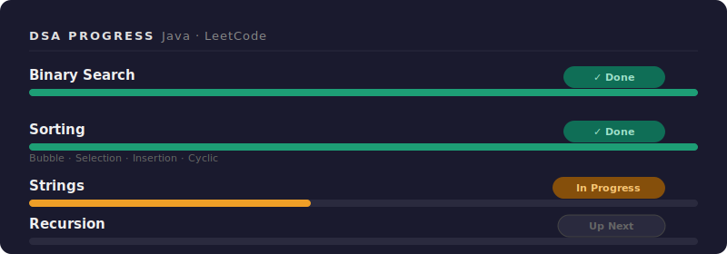

# Yashraj Sahu

> 18, Anime, Games, Draw, Code

---

## About Me

- 🎓 First-year B.Tech student pursuing engineering from LNCT Bhopal.
- 🌱 Currently learning **JavaScript** and **Data Structures & Algorithms**
- ☕ Writing clean code in **Java** and building for the web
- 📍 Based in Bhopal, India

---

## Tech Stack

**Languages**

**Currently Exploring**

---

## 📊 DSA Progress — Java

| Topic | Status | Subtopics |
|-------|--------|-----------|
| Binary Search | ✅ Done | — |
| Sorting | ✅ Done | Bubble · Selection · Insertion · Cyclic |
| Strings | 🔶 In Progress | — |
| Recursion | ⬜ Up Next | — |

---

## Let's Connect

---
